# Noviflix Android App

## Description
Noviflix is a modern application designed to provide movie information by consuming a specific API.


## Development Details
- **Primary Device Used:** Google Pixel 8a
- **Minimum SDK:** 24
- **Target SDK:** 35

The app was developed and tested to ensure compatibility and smooth performance on modern devices. It uses dynamic build configurations to adapt to development and production environments.


---

## Setup Instructions

### 1. Configuring Network Security
If the API uses an `HTTP` endpoint, you must configure the app to allow insecure traffic during debugging.

#### Steps:
1. Create a file named `network_security_config.xml` in the `src/debug/res/xml/` directory.
2. Add the following content to allow HTTP traffic for the desired domain:

   ```xml
   <network-security-config>
       <domain-config cleartextTrafficPermitted="true">
           <domain includeSubdomains="true">example.com</domain>
       </domain-config>
   </network-security-config>
   ```

3. Ensure that the `debug` variant in your `AndroidManifest.xml` references this file:

   ```xml
   <application
       android:networkSecurityConfig="@xml/network_security_config">
   </application>
   ```

---

### 2. Setting Up the `DEBUG_BASE_URL` for Development

The `build.gradle` dynamically sets the base URL for API calls using a system environment variable (`DEBUG_BASE_URL`) or a fallback defined in `local.properties`. This ensures flexibility across different environments (e.g., Windows, Linux).

#### Why This Approach?
- **System Variable Priority**: Ensures that the app can dynamically use an environment-specific URL without requiring changes to the codebase.
- **Fallback to `local.properties`**: Useful for developers who don’t want to configure system variables manually, especially on Linux systems where system variables might not propagate properly.

---

#### Setting the `DEBUG_BASE_URL`

1. **For Windows**
   - Open the Environment Variables settings.
   - Add a new **User Variable** with:
      - **Variable Name:** `DEBUG_BASE_URL`
      - **Value:** `http://your_debug_api_base_url/`

2. **For Linux**
   - Add the following to your `~/.bashrc` or `~/.zshrc` or `~/.profile` file:
     ```bash
     export DEBUG_BASE_URL="http://your_debug_api_base_url/"
     ```
   - Apply the changes:
     ```bash
     source ~/.bashrc
     ```

3. **For macOS**
   - Add the following to your `~/.zshrc` file:
     ```bash
     export DEBUG_BASE_URL="http://your_debug_api_base_url/"
     ```
   - Apply the changes:
     ```bash
     source ~/.zshrc
     ```

---

### 3. Fallback to `local.properties`

If you don’t want to use system variables, you can define the `DEBUG_BASE_URL` in a `local.properties` file.

#### Steps:
1. Open the `local.properties` file in the root of your project.
2. Add the following line:
   ```properties
   DEBUG_BASE_URL=http://your_debug_api_base_url/
   ```

> **Note:** `local.properties` is excluded from version control by default (`.gitignore`), ensuring sensitive data remains secure.

---


# Screenshots

Here are some screenshots of the application:

<p align="center">
  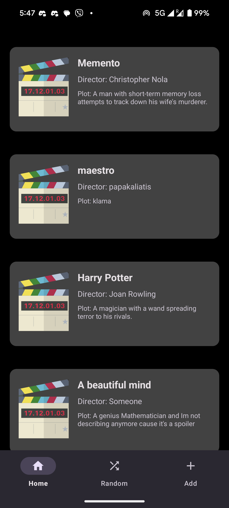
  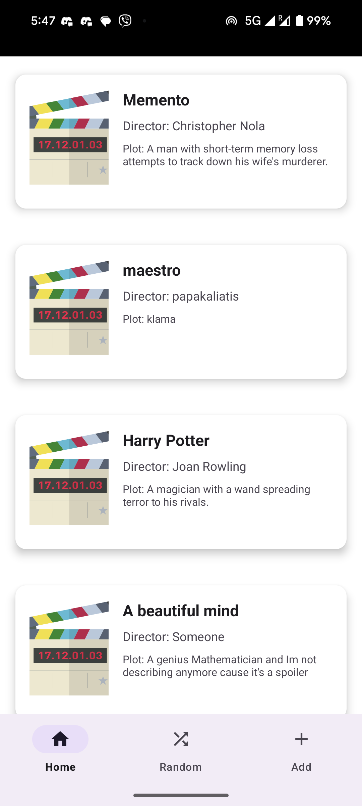
  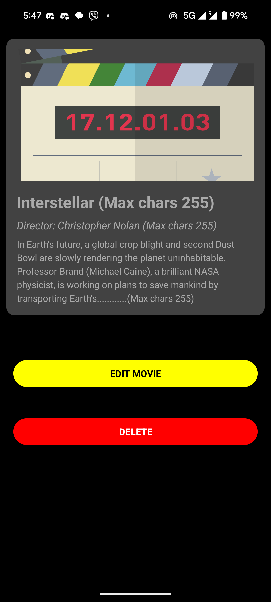
  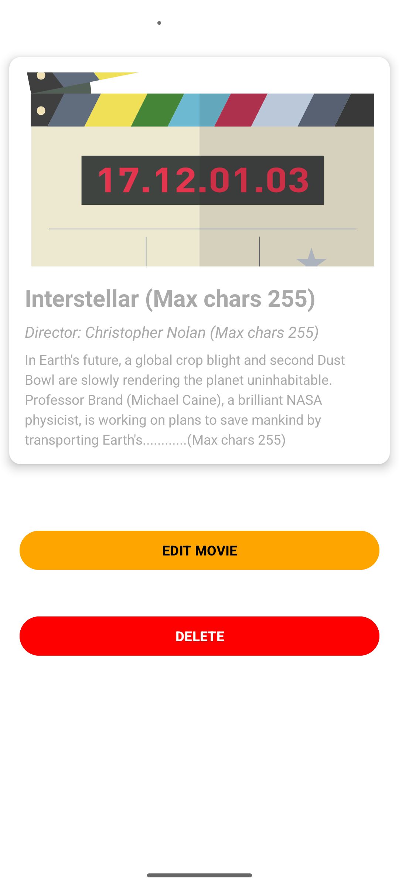
  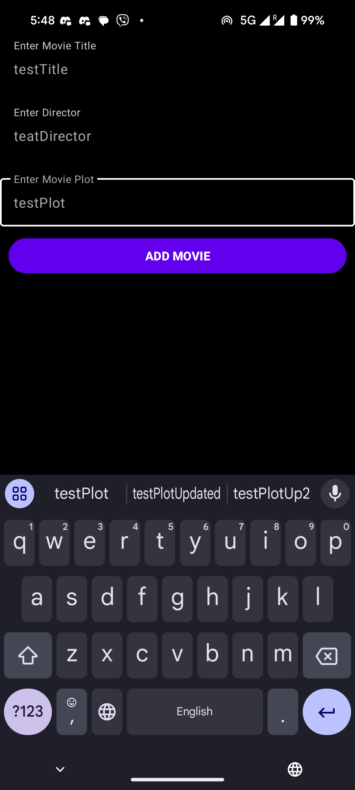
  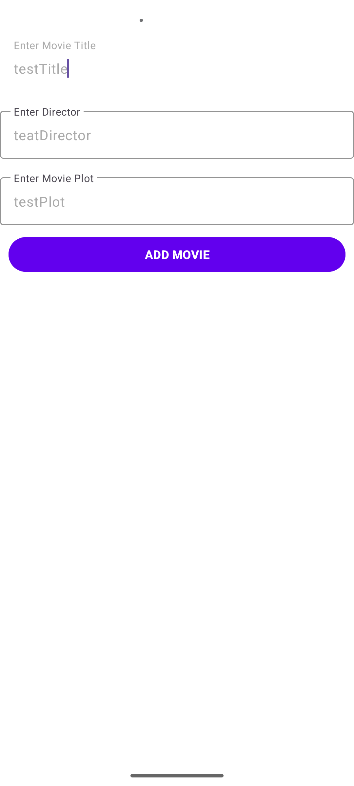
  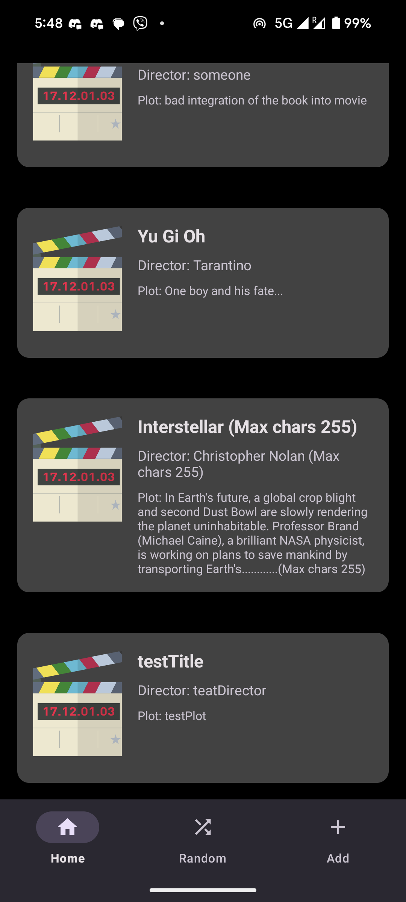
  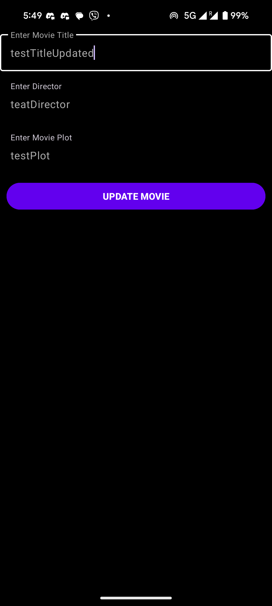
  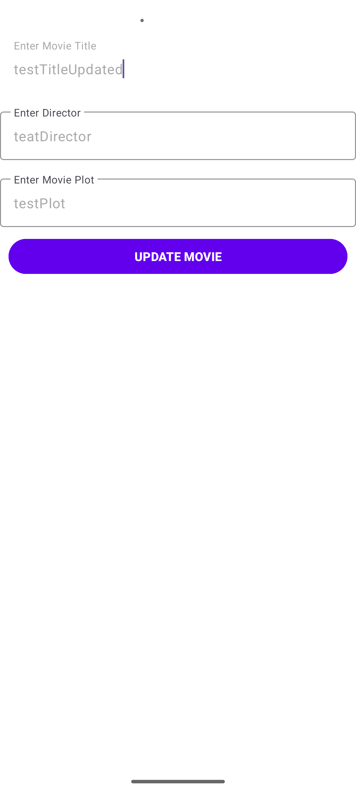
  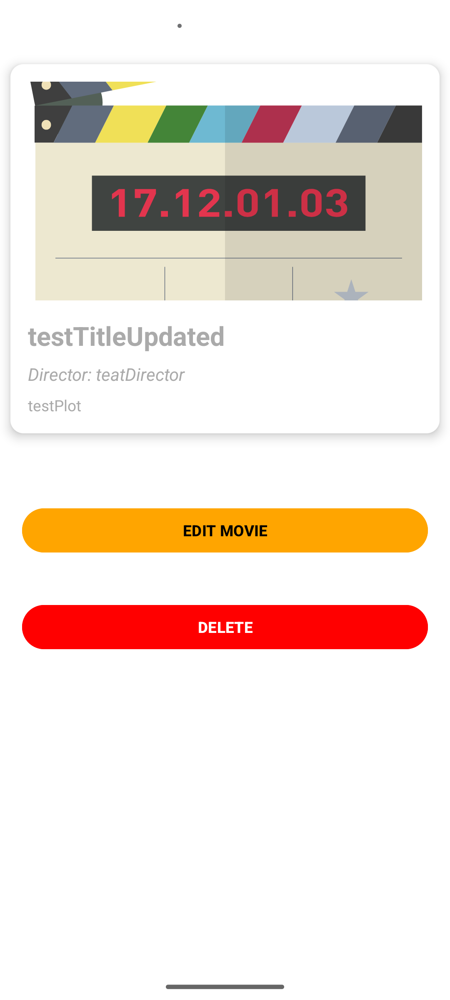
  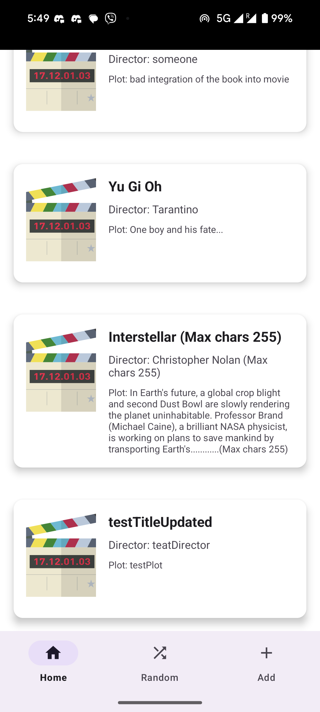
  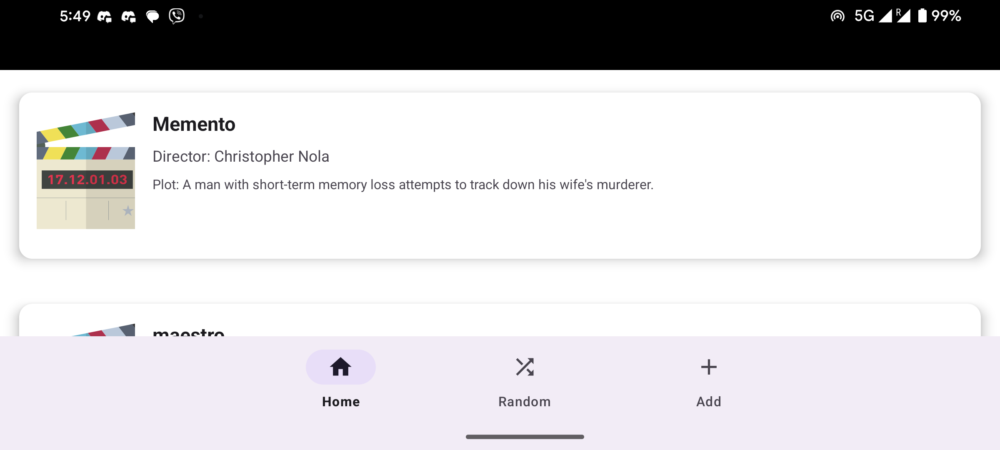
  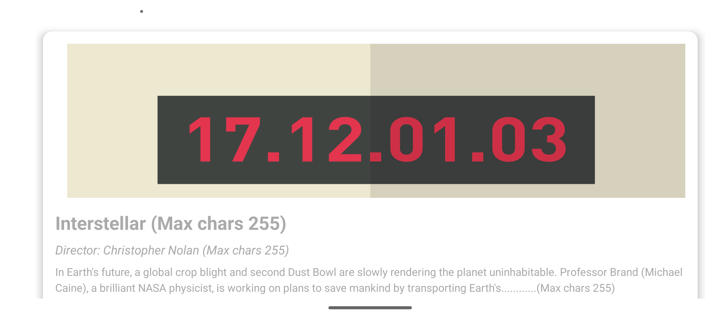
  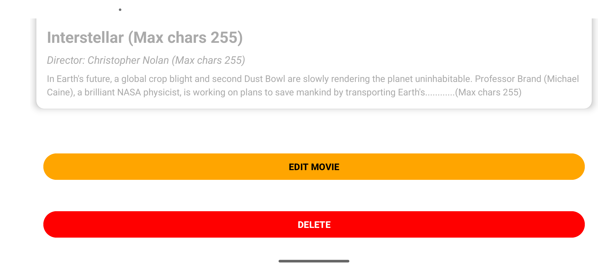
  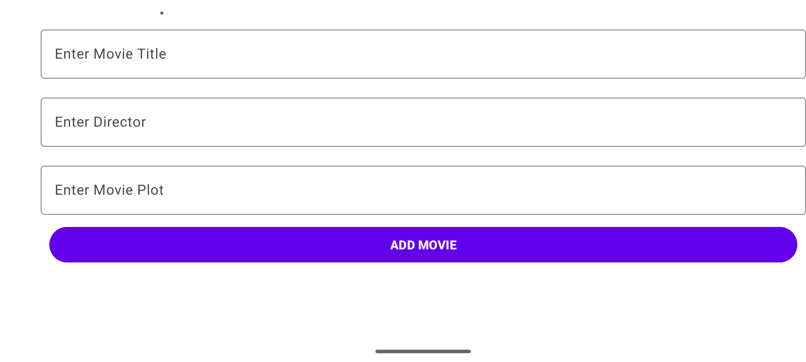
</p>
